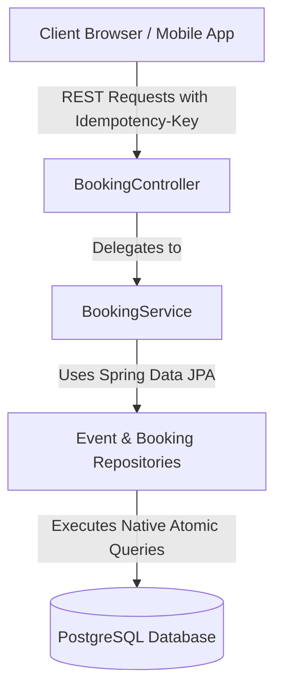
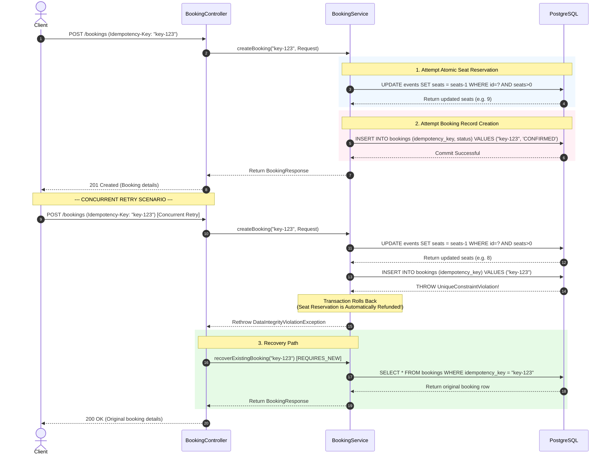
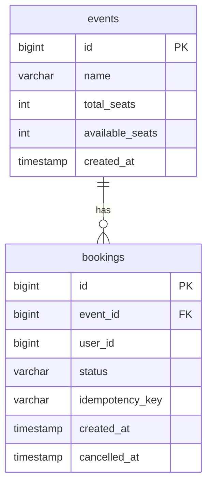

# Concurrency-Safe Event Booking System

[](https://openjdk.org/projects/jdk/25/)
[](https://spring.io/projects/spring-boot)
[](https://www.postgresql.org/)
[](https://testcontainers.com/)

A high-performance, production-ready RESTful backend demonstrating how to handle high-concurrency ticket booking scenarios (e.g., flash sales, high-demand concert ticket bookings) safely and efficiently. 

This project is designed specifically to solve the core challenges of backend engineering: **race conditions, over-allocation, double-booking, and API idempotency.**

---

## 🌟 The Core Technical Challenges & Solutions

In a high-demand ticketing system (like Ticketmaster or Eventbrite), thousands of users might attempt to buy tickets for a limited-seat event at the exact same millisecond. Doing a simple read-modify-write cycle (`SELECT` seats -> `IF` seats > 0 -> `UPDATE` seats -> `INSERT` booking) will lead to **over-allocation** and **inconsistent states** due to race conditions.

This system solves these issues at the database and API layer using three primary design patterns:

### 1. Atomic Database Updates (Race Condition & Over-allocation Prevention)
* **The Problem:** Two threads read `available_seats = 1` simultaneously. Both check that a seat is available, and both issue an update to deduct 1, resulting in `0` seats but `2` confirmed bookings (over-allocation/overselling).
* **The Solution:** We bypass application-level checks and execute an **atomic, state-guarded native SQL update** in a single database round-trip:
  ```sql
  UPDATE events 
  SET available_seats = available_seats - 1 
  WHERE id = :eventId AND available_seats > 0 
  RETURNING available_seats;
  ```
  Postgres executes this statement under a row-level write lock. If another concurrent thread attempts to update the same row, it blocks until the first transaction commits or rolls back. If the seats drop to `0`, the `available_seats > 0` condition fails, the query returns `null`, and the system throws a `SoldOutException`.

### 2. Idempotent API with Write-Path Recovery (Network/Retry Safety)
* **The Problem:** A client submits a booking request, the server processes it successfully, but the network connection drops before the client receives the response. The client retries the request. Without idempotency, this results in the user purchasing multiple seats.
* **The Solution:** The client passes an `Idempotency-Key` header.
  * **First Request:** Inserts a booking record with the key into a table where `idempotency_key` is configured with a `UNIQUE` constraint.
  * **Concurrent Retry Race:** If a retry request arrives *while the first is still processing*, the second insert violates the unique constraint, throwing a `DataIntegrityViolationException`.
  * **Recovery Path:** The controller catches the exception, rolls back the failed retry transaction, and initiates a **new propagation transaction** (`REQUIRES_NEW`) to safely query and return the already-created booking, ensuring a unified success response without allocating extra seats.

### 3. Partial Unique Indexes (Double-Booking Prevention)
* **The Problem:** A user clicks "Book Now" multiple times in separate tabs, leading to multiple active bookings for the same event, violating business logic. However, if a user books an event, cancels it, and decides to book it again later, that *should* be allowed.
* **The Solution:** A standard composite unique index `(user_id, event_id)` would prevent the user from ever booking the event again after a cancellation. Instead, we use a **PostgreSQL Partial Unique Index**:
  ```sql
  CREATE UNIQUE INDEX idx_unique_active_booking 
  ON bookings (user_id, event_id) 
  WHERE (status = 'CONFIRMED');
  ```
  This index guarantees that a user can have at most **one** active booking per event at any given time, while fully supporting historical, cancelled bookings.

---

## 📐 System Architecture

### Component Diagram



### Sequence Diagram: Idempotent Booking Flow

The sequence diagram below shows how the system processes concurrent booking attempts, including handling retries and recovery.



---


**Constraints**

### events
- `name` — NOT NULL
- `total_seats` — NOT NULL
- `available_seats` — NOT NULL
- `created_at` — NOT NULL

### bookings
- `event_id` — Foreign Key → `events.id`
- `user_id` — NOT NULL
- `status` — `CONFIRMED` or `CANCELLED`
- `idempotency_key` — UNIQUE, nullable
- `created_at` — NOT NULL
- `cancelled_at` — nullable

### Essential DDL
While Hibernate automatically generates the tables from `@Entity` mappings, the following **PostgreSQL-specific DDL** must be applied to enforce the partial unique constraint and avoid application-level race conditions:

```sql
-- Ensure users cannot book the same event twice simultaneously
CREATE UNIQUE INDEX idx_unique_active_booking 
ON bookings (user_id, event_id) 
WHERE (status = 'CONFIRMED');
```

---

## 🛠️ Technology Stack

* **Language:** Java 25 (utilizing modern features such as Records and Pattern Matching)
* **Framework:** Spring Boot 4.1.0
* **Data Access:** Spring Data JPA (Hibernate)
* **Database:** PostgreSQL
* **API Documentation:** Springdoc OpenAPI / Swagger UI
* **Testing:** JUnit 5, Testcontainers (spinning up real PostgreSQL instances for integration tests)
* **Build Tool:** Maven

---

## 📊 API Documentation & Endpoints

When the application is running, the interactive Swagger UI is available at:
`http://localhost:8080/swagger-ui/index.html`

### 1. Create an Event
* **Endpoint:** `POST /events`
* **Request Body:**
  ```json
  {
    "name": "Spring I/O Conference 2026",
    "totalSeats": 100
  }
  ```
* **Response (201 Created):**
  ```json
  {
    "id": 1,
    "name": "Spring I/O Conference 2026",
    "totalSeats": 100,
    "availableSeats": 100,
    "createdAt": "2026-07-10T10:00:00"
  }
  ```

### 2. Create a Booking (Idempotent & Concurrency-Safe)
* **Endpoint:** `POST /bookings`
* **Headers:** 
  * `Idempotency-Key: <unique-uuid>` (Optional, but highly recommended)
* **Request Body:**
  ```json
  {
    "eventId": 1,
    "userId": 42
  }
  ```
* **Response (201 Created / 200 OK):**
  ```json
  {
    "bookingId": 25,
    "eventId": 1,
    "userId": 42,
    "status": "CONFIRMED"
  }
  ```

### 3. Cancel a Booking
* **Endpoint:** `POST /bookings/{bookingId}/cancel`
* **Response (200 OK):** Empty Body

### 4. Fetch Bookings for an Event (Paginated)
* **Endpoint:** `GET /bookings/events/{eventId}?page=0&size=20`
* **Response (200 OK):** Standard Spring Data Page object containing active/cancelled bookings.

---

## 🧪 Integration Testing (Testcontainers)

To verify correctness under extreme concurrency, the project features a robust integration suite in `BookingConcurrencyTest.java` that uses **Testcontainers** to spin up an isolated, ephemeral PostgreSQL Docker container.

### 1. Testing Atomic Seat Reservations (`testConcurrentBookings_naiveApproach`)
* **Scenario:** We create an event with **10 seats**. We spawn **200 threads** that all attempt to book a seat simultaneously.
* **Assertion:** Exactly **10 bookings succeed** and the available seats in the database drop to **exactly 0**. 190 threads fail gracefully with a `SoldOutException` (HTTP 409).

### 2. Testing Idempotent Retries (`testConcurrentBookings_sameIdempotencyKey`)
* **Scenario:** We create an event with 50 seats. We spawn **50 concurrent threads** representing a client retrying their request, all using the **exact same `Idempotency-Key`**.
* **Assertion:** 
  * All 50 requests receive a successful response.
  * **Exactly 1 seat is consumed** (leaving 49 available).
  * **Exactly 1 booking row is created** in the database.

---

## 🚀 How to Run Locally

### Prerequisites
* JDK 25 installed
* Docker daemon running (required for running the integration tests via Testcontainers)
* PostgreSQL database instance running (if running the application locally)

### Running the Tests
To run the integration tests:
```bash
./mvnw clean test
```

### Running the Application
1. Configure your PostgreSQL database credentials in `src/main/resources/application.properties` or set them as environment variables:
   ```bash
   export DATABASE_URL=jdbc:postgresql://localhost:5432/your_db
   export DATABASE_USERNAME=postgres
   export DATABASE_PASSWORD=your_password
   ```
2. Build and run:
   ```bash
   ./mvnw spring-boot:run
   ```
3. Connect to the database and run the essential index DDL:
   ```sql
   CREATE UNIQUE INDEX idx_unique_active_booking ON bookings (user_id, event_id) WHERE (status = 'CONFIRMED');
   ```

---

## 🎓 Interview Talking Points (Backend Engineering Focus)

If you are explaining this project in an interview, be prepared to talk about:

1. **Why not use application-level locking (e.g. Java `synchronized` or `ReentrantLock`)?**
   * *Answer:* Application-level locking only works if there is a single instance of the application. In a real production environment, the backend is horizontally scaled (running across multiple instances behind a load balancer). JVM locks do not coordinate across different instances. Database-level atomic updates scale across multiple application instances.

2. **Why not use Hibernate's `@Version` (Optimistic Locking)?**
   * *Answer:* Optimistic locking throws an exception on conflict, requiring the application to catch the exception, retry the transaction, and re-read the seat count. Under extreme load (e.g., 1,000 requests per second on a single event), optimistic locking causes massive transaction rollback rates and degrades performance. Atomic updates handle the seat allocation directly in the DB engine without rollbacks or client-side retries.

3. **How does the Idempotency Recovery Pattern work without double allocation?**
   * *Answer:* When the concurrent retry request hits the insert statement, Postgres throws a unique key violation. The Spring transaction for *that specific request* rolls back, which automatically reverts any seat deductions that occurred in that transaction. Then, the controller intercepts the error and calls a fresh `Propagation.REQUIRES_NEW` service method. This executes in a completely clean transaction, finds the original booking created by the winning thread, and returns it.

4. **Why use a PostgreSQL Partial Unique Index instead of checking in code?**
   * *Answer:* Checking in code (`if (bookingRepository.existsByUserIdAndEventIdAndStatusConfirmed())`) is vulnerable to a classic **Time-of-Check to Time-of-Use (TOCTOU)** race condition. Two concurrent threads can both check and find no booking, then both proceed to insert. By delegating the rule to a Postgres partial index, we guarantee safety at the storage engine level.
